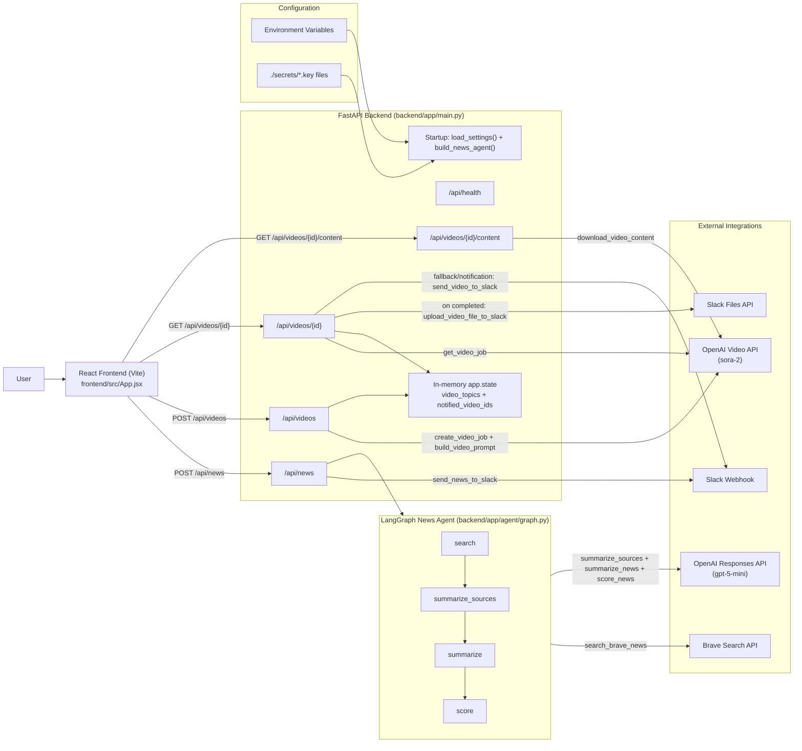

# BTG News Tracker Architecture

## Notes
- The news workflow is a strict linear LangGraph pipeline: `search -> summarize_sources -> summarize -> score`.
- There is no database; runtime video-tracking metadata is kept in FastAPI `app.state`.
- Source recency is enforced in backend search filtering (parseable published date within last 7 days).
