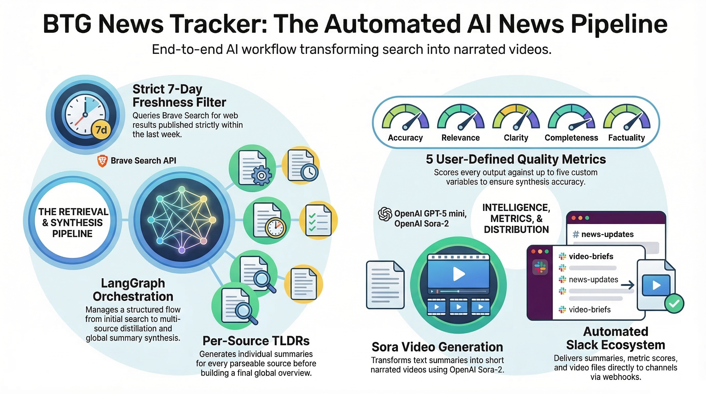
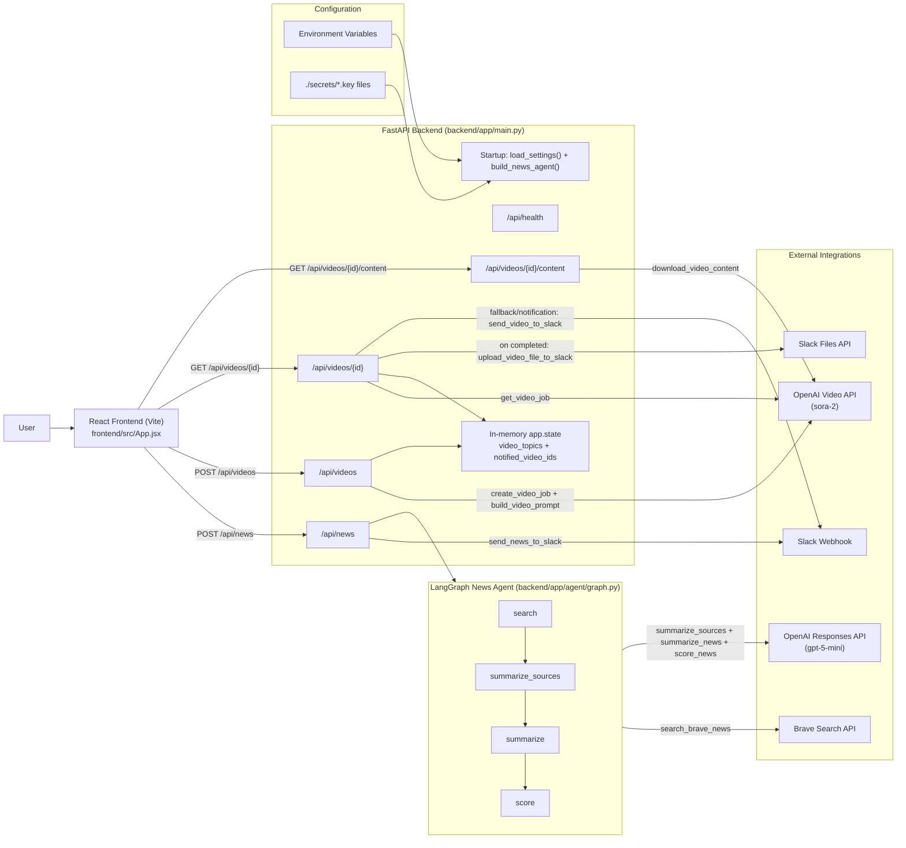

Topic-driven news agent with:
- FastAPI backend
- LangGraph orchestration (`search -> summarize_sources -> summarize -> score`)
- Brave Search API for latest web results (last 7 days)
- OpenAI GPT-5 mini for synthesis
- OpenAI Sora video generation (`sora-2`) for summary narration
- React frontend

# Architecture Diagram




**Backend flow:**
1. Accept topic (`POST /api/news`)
2. Query Brave Search with `freshness=pw` (past week)
3. Strictly keep only parseable sources published within the last 7 days
4. Dedupe by canonical URL and normalized title
5. Generate per-source tldr summaries
6. Build final global summary from tldr summaries + source snippets
7. Score the output against up to 5 user-defined metrics (`variable` + `description`)
8. Return summary + source list + per-source metric scores
9. Optionally generate a short narrated video from the summary via Sora (`/api/videos`)

## Keys

This project reads keys from either env vars or files in `./secrets/`:
- `BRAVE_API_KEY` or `./secrets/bravesearchapi.key`
- `OPENAI_API_KEY` or `./secrets/openai.key`
- `SLACK_WEBHOOK_URL` or `./secrets/slackwebhook.key`
- `SLACK_BOT_TOKEN` or `./secrets/slacktoken.key` (needed for Slack file attachment upload)
- `SLACK_CHANNEL_ID` or `./secrets/slackchannelid.key` (channel to post uploaded video file)
- `PUBLIC_API_BASE_URL` (optional, used to include a playable video link in Slack notifications)

## Run backend

```bash
cd backend
python3 -m venv .venv
source .venv/bin/activate
pip install -r requirements.txt
python -m uvicorn app.main:app --reload --port 8000
```

Health check:

```bash
curl http://localhost:8000/api/health
```

Backend logs are also written to `backend/logs/app.log` (rotating file, 5 backups).

## Run frontend

```bash
cd frontend
npm install
npm run dev
```

Frontend default API base is `http://localhost:8000`.
Override with:

```bash
VITE_API_BASE_URL=http://localhost:8000 npm run dev
```

## Sample API call

```bash
curl -X POST http://localhost:8000/api/news \
  -H "Content-Type: application/json" \
  -d '{
    "topic":"Agentic AI",
    "scoring_metrics":[
      {"variable":"Source credibility","description":"Higher if sources are reputable and consistent"},
      {"variable":"Actionability","description":"Higher if summary gives clear practical takeaways"}
    ]
  }'
```

## Video API

Create video job:

```bash
curl -X POST http://localhost:8000/api/videos \
  -H "Content-Type: application/json" \
  -d '{
    "topic":"Agentic AI",
    "summary":"<paste summary text here>",
    "seconds":12,
    "size":"1280x720"
  }'
```

`seconds` allowed values: `4`, `8`, `12`.
Before calling Sora, the backend distills the long summary into a duration-fit narration script.

Check job:

```bash
curl http://localhost:8000/api/videos/<video_id>
```

Download when status is `completed`:

```bash
curl -L http://localhost:8000/api/videos/<video_id>/content -o summary.mp4
```

To force attachment download header:

```bash
curl -L \"http://localhost:8000/api/videos/<video_id>/content?download=true\" -o summary.mp4
```

## Notes

- "Last 7 days" is enforced twice: Brave's weekly freshness filter and strict backend date filtering.
- Date filtering keeps only sources with parseable timestamps that fall inside the rolling 7-day window.
- Current tradeoff: strict filtering may return fewer results for topics where many pages have missing/ambiguous publish dates.
- On successful generation, the backend sends the topic summary, source tldrs, and scoring results to Slack via webhook.
- Video narration prompt is configured to avoid imitating real people/public figures.
- When a video job reaches `completed`, backend tries to upload the mp4 to Slack (bot token + channel id). If upload fails, it falls back to webhook notification.
- Slack file upload requires `files:write` scope (and channel posting access). `connections:write` alone is not sufficient.
